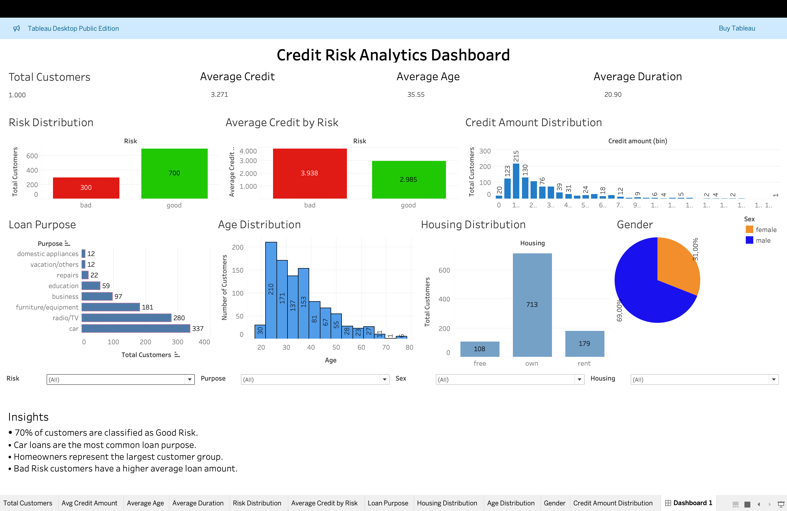

# 📊 Credit Risk Analytics Dashboard

## Dashboard Preview



------------------------------------------------------------------------

## 📌 Project Overview

This project analyzes customer credit data to understand customer
demographics, loan characteristics, housing status, and credit risk. SQL
was used for data cleaning and business analysis, while Tableau Public
was used to build an interactive dashboard for decision-making.

## 🎯 Business Problem

Banks need to identify high-risk customers while understanding customer
behavior and lending patterns. This dashboard helps answer key business
questions and supports data-driven lending decisions.

## ✅ Objectives

-   Clean and prepare the dataset
-   Perform Exploratory Data Analysis (EDA)
-   Answer business questions using SQL
-   Build an interactive Tableau dashboard
-   Generate actionable business insights

## 📂 Dataset

-   Dataset: German Credit Risk Dataset
-   Records: 1,000
-   Features: Age, Sex, Job, Housing, Saving Accounts, Checking
    Account, Credit Amount, Duration, Purpose, Risk

## 🛠️ Tools & Technologies

-   MySQL
-   Python (Pandas)
-   Google Colab
-   Tableau Public
-   Microsoft Excel
-   Git & GitHub

## 🧹 Data Cleaning

-   Checked missing values
-   Replaced missing categorical values with Unknown
-   Verified data types
-   Created Age Group
-   Created Loan Size
-   Exported cleaned dataset

## 🔍 SQL Analysis

Business questions answered: - Which age group has the highest average
credit amount? - Which loan purpose has the highest average duration? -
How many female customers have Bad Risk? - Which housing type has the
highest average loan amount? - Which job category has the most Bad Risk
customers?

SQL concepts used: - GROUP BY - ORDER BY - Aggregate Functions - CASE
WHEN - Subqueries

## 📈 Dashboard Features

-   KPI Cards
-   Risk Distribution
-   Average Loan Amount by Risk
-   Loan Purpose Distribution
-   Housing Distribution
-   Customer Age Distribution
-   Credit Amount Distribution
-   Gender Distribution
-   Interactive Filters

## 💡 Key Business Insights

-   Around 70% of customers are classified as Good Risk.
-   Car loans are the most common loan purpose.
-   Homeowners represent the largest customer group.
-   Bad Risk customers have a higher average loan amount.

## 📁 Project Structure

``` text
Credit-Risk-Analytics/
├── Data/
│   ├── Raw/
│   └── Processed/
├── SQL/
├── Tableau/
├── Screenshots/
│   └── dashboard.png
└── README.md
```

## 🚀 Future Improvements

-   Build a machine learning model for credit risk prediction.
-   Create a Power BI version.
-   Add customer segmentation.
-   Publish an online interactive dashboard.

## 👤 Author

Dhanashri Vidhate

Aspiring Data Analyst

LinkedIn: https://www.linkedin.com/in/dhanashrim
